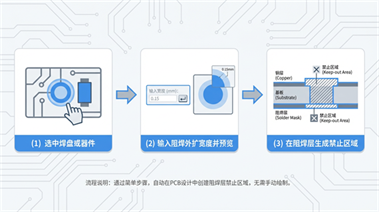

# 焊盘阻焊外扩助手（`pad-expand-helper`）

在 **PCB 编辑器**中，按所选 **焊盘或器件** 批量生成 **阻焊外扩几何**：可输出为 **电气层上的禁止区域**（控制铺铜/填充），或 **仅阻焊层填充图形**。适用于需要按固定外扩量快速布置阻焊开窗与工艺禁区的场景。

## 功能示意图



> 若示意图与当前交互不完全一致，以下方「使用说明」为准。

## 扩展标识

| 属性 | 值 |
|------|-----|
| name | `pad-solder-mask-guard` |
| uuid | `23d6d62d80c44cc28c5c608ac3126f32` |
| displayName | **`pad-expand-helper`**（中文界面一级菜单为「焊盘阻焊外扩助手」，与英文 **`pad-expand-helper`** / `pad-expand-helper: …` 对应） |
| version | 见 `extension.json` |
| license | Apache-2.0 |
| categories | PCB |
| 入口 entry | `./dist/index`（构建产物为 `dist/index.js`） |

> **name 唯一性**：扩展商店要求 **不同 uuid 的扩展不能使用相同的 `name`**。若上架审核提示命名冲突，请将 `extension.json` 中的 `name` 改为未占用的名称（仅小写字母、数字、中划线，长度 5–30），并重新构建上传。

## 功能说明

### 生成类型（三选一）

在设置窗口中选择结果落在哪一类规则上：

| 类型 | 含义 |
|------|------|
| **禁止区域（禁止铺铜，默认）** | 在对应 **电气层** 上生成区域规则，用于禁止铺铜。 |
| **禁止区域（禁止填充）** | 同上思路，面向禁止填充的规则语义（与铺铜选项二选一使用场景）。 |
| **阻焊区域（仅阻焊层图形）** | 仅在 **顶层 / 底层阻焊层** 保留填充图元，不转电气层禁止区域。 |

外扩几何先在阻焊层侧构造，再按类型 **转为禁止区域** 或 **保留为阻焊填充**；圆形焊盘等会生成 **外环减内环** 的环形填充（见更新日志 1.0.2）。

### 工作流程

1. 通过菜单打开功能后，优先弹出 **内联设置页**（`iframe/index.html`）：选择生成类型、输入 **外扩宽度**（相对焊盘外形各向外的单边宽度），并选择是否 **连续生成模式**。若内联页不可用，会回退为系统原生对话框流程。
2. **单次生成**：对 **当前已选中** 的焊盘/器件焊盘/器件（展开全部焊盘）处理一次后结束。
3. **连续生成模式**：设置应用后可在画布上 **多次点选或框选** 焊盘/器件；**Esc** 或 **鼠标右键** 退出；再次运行菜单可结束并重新设置。

### 选择与分层

- **选择**：可直接选 **焊盘**、**器件焊盘**，或选 **器件**（自动展开其下全部焊盘并去重）；支持多选与混合选择。
- **分层**：顶层焊盘 → 顶层阻焊/对应电气层；底层焊盘 → 底层；跨层/多层焊盘 → 顶、底两侧各生成对应图元。无对应阻焊/电气映射的内层等特殊焊盘会 **跳过** 并提示。

### 几何与单位

- **外形**：圆、矩形、椭圆、跑道形、正多边形、复杂多边形等常见焊盘轮廓均支持；外扩采用 **折线拟合**（无独立圆弧图元）。
- **单位**：读取当前 **画布单位**，输入值会换算为 PCB 内部 **mil** 后生成；外扩有 **上限**（当前源码中为 **2000 mil**，以实际编译常量为准）。

### 反馈与异常

- 成功或部分成功会通过 **吐司** 提示生成数量；部分条目失败会列出简要原因（如内层焊盘跳过、禁止区域转换失败等）。
- 未选中有效焊盘、仅在非 PCB 环境运行等会给出明确对话框或吐司说明。

### 资源与配置（extension.json）

- **logo**：`./images/logo.png`（正方形图标，建议 ≥500×500，PNG/JPEG）。
- **banner**：`./images/banner.jpg`（扩展商店横幅，比例 **64:27**，JPEG，见[官方说明](https://prodocs.lceda.cn/cn/api/guide/extension-json.html)）。

## 使用说明

### 环境要求

- **嘉立创 EDA 专业版 / EasyEDA 专业版**，版本需满足 `extension.json` 中 `engines.eda`（当前为 `^3.0.0`）。

### 操作步骤

1. 打开 **PCB** 设计文件。
2. **单次模式**：在画布中先 **选中** 目标（焊盘、器件焊盘或器件）。
3. 在顶部菜单栏找到 **`焊盘阻焊外扩助手`** → **`焊盘阻焊外扩…`**（英文为 **`pad-expand-helper`** → **`pad-expand-helper: expand…`**；内联设置页英文标题 **`pad-expand-helper: setup`**；以客户端显示为准）。
4. 在设置窗口中完成：**生成类型**、**外扩宽度**、是否 **连续生成**。
5. **连续模式**：进入后在画布上反复点选/框选即可生成；用 **Esc** 或 **右键** 退出连续模式。

### 菜单说明

| 菜单项 | 作用 |
|--------|------|
| 焊盘阻焊外扩助手 / **pad-expand-helper**（一级，英文） | 分组入口 |
| 焊盘阻焊外扩… / `pad-expand-helper: expand…` | 打开设置并执行生成（与 `extension.json` 子菜单 `pad-expand-helper: expand...` 对应） |
| About... | 显示当前扩展版本号 |

### 常见问题

- **未选中有效对象（单次模式）**：请先选中至少一个焊盘或包含焊盘的器件。
- **选中但不含焊盘**：会提示当前选中对象不包含焊盘。
- **看不到菜单或功能无效**：请在 **PCB 编辑器** 中打开电路板后再试；本扩展在 `home` / `sch` / `pcb` 等均注册了入口，核心逻辑针对 PCB。
- **设置窗口打不开**：内联框架 API 可能因版本差异失败，可更新客户端；若持续失败，请通过反馈附上版本号。
- **上传商店报 banner 缺失**：确保打包内存在 `images/banner.jpg`，且 `extension.json` 的 `images.banner` 为 `./images/banner.jpg`。本地可用 `scripts/gen-banner.ps1` 生成占位横幅后再 `npm run build`。

## 开发与构建

```bash
npm install
npm run compile   # 生成 dist/index.js
npm run lint
npm run build     # 编译并打包 .eext 到 build/dist
```

构建完成后，在 `build/dist` 目录获取 **`pad-solder-mask-guard_v<version>.eext`**（由 `extension.json` 的 **`name`** 与 **`version`** 组成，与扩展商店标识一致；**不要**为「好听」单独改打包脚本里的文件名而保留错误的 `name`）。在客户端中安装该扩展包。

**入口文件**：`extension.json` 中 `entry` 为 `./dist/index`；发布前请务必执行 `npm run compile`（或 `npm run build`），保证 **`dist/index.js` 存在且与源码一致**。内联设置页位于 `iframe/`，需一并打入扩展包。

## API 与许可

- 开发指南：<https://prodocs.lceda.cn/cn/api/guide/>
- API 参考：<https://prodocs.lceda.cn/cn/api/reference/pro-api.html>
- 许可：**Apache-2.0**
